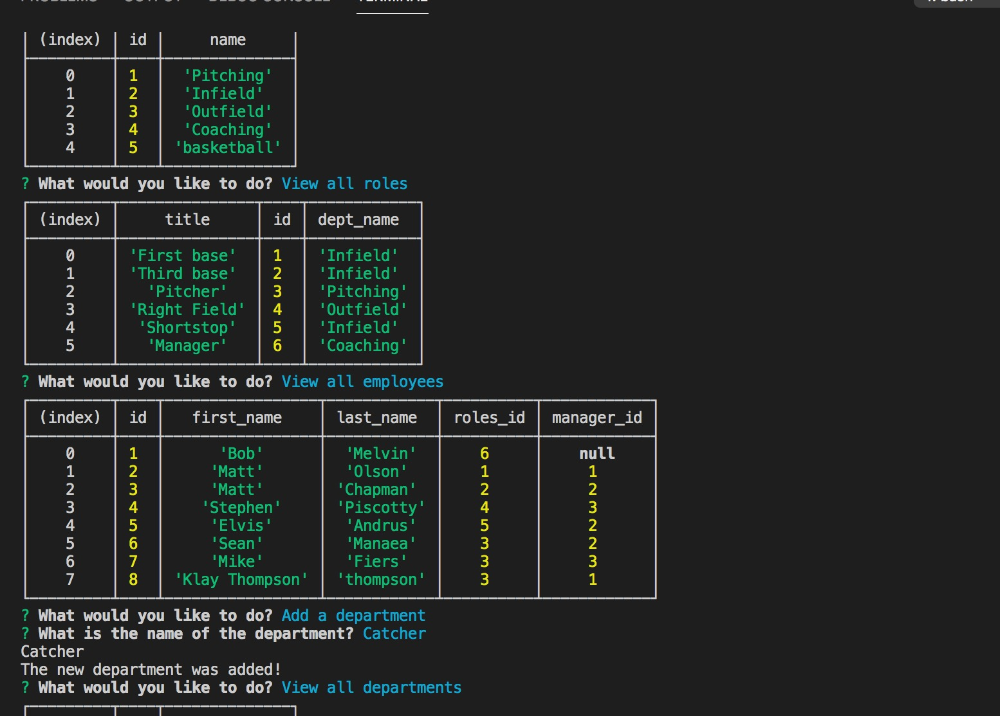

# Employee-Tracker

## Description 

As a manager keeping tracking of your crew is an extremely important aspect of your responsibilites! This well-crafted app allows you to keep track of your essential workers. You'll never forget who works for you or what they're doing ever again!

To see my application's code, here is my [Employee-Tracker GitHub Repository](https://github.com/Clayto30/employee-tracker).

If you would like to see the app's functionality, please view my [Employee-Tracker Walkthrough video](https://drive.google.com/file/d/1NSbUZy76_VcijnU1nVWqwM10ypHoMN99/view).

## Table of Contents (Optional)

* [Installation](#installation)
* [Usage](#usage)
* [Credits](#credits)
* [License](#license)

## Installation

Clone the repository from GitHub! Be sure to run an intall on the necessary Node packages. This one requires Node JS, Inquirer, MySql2 npm and the Console Table Package.

Once you have it running you can run the npm start command in the command line, and prompts will begin!

## Usage 

Follow the prompts!

You can view all the departments, view all the roles, add a department, add a role, add an employee, or update an employee!

Choose which one you would like and the app accesses the database appropriately for you!

## Credits

This project was created as a project as part of the UC Berkeley Coding Bootcamp instruction. My instructor and especially those ever-helpful TA's deserve special recognition.

## License

Copyright 2021 Clayton Goff

Permission is hereby granted, free of charge, to any person obtaining a copy of this software and associated documentation files (the "Software"), to deal in the Software without restriction, including without limitation the rights to use, copy, modify, merge, publish, distribute, sublicense, and/or sell copies of the Software, and to permit persons to whom the Software is furnished to do so, subject to the following conditions:

The above copyright notice and this permission notice shall be included in all copies or substantial portions of the Software.

THE SOFTWARE IS PROVIDED "AS IS", WITHOUT WARRANTY OF ANY KIND, EXPRESS OR IMPLIED, INCLUDING BUT NOT LIMITED TO THE WARRANTIES OF MERCHANTABILITY, FITNESS FOR A PARTICULAR PURPOSE AND NONINFRINGEMENT. IN NO EVENT SHALL THE AUTHORS OR COPYRIGHT HOLDERS BE LIABLE FOR ANY CLAIM, DAMAGES OR OTHER LIABILITY, WHETHER IN AN ACTION OF CONTRACT, TORT OR OTHERWISE, ARISING FROM, OUT OF OR IN CONNECTION WITH THE SOFTWARE OR THE USE OR OTHER DEALINGS IN THE SOFTWARE.